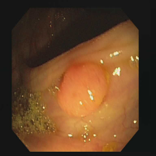

# tf.data: TensorFlow-Input-Data-Pipeline-for-Semantic-Segmentation

A simple code for building an input dataset pipeline for semantic segmentation using TensorFlow tf.data API.
  
Video explaination: [https://youtu.be/C5CbsTDwQM0](https://youtu.be/C5CbsTDwQM0)

|   |
| :--: |
| *Image and its respective mask* |
